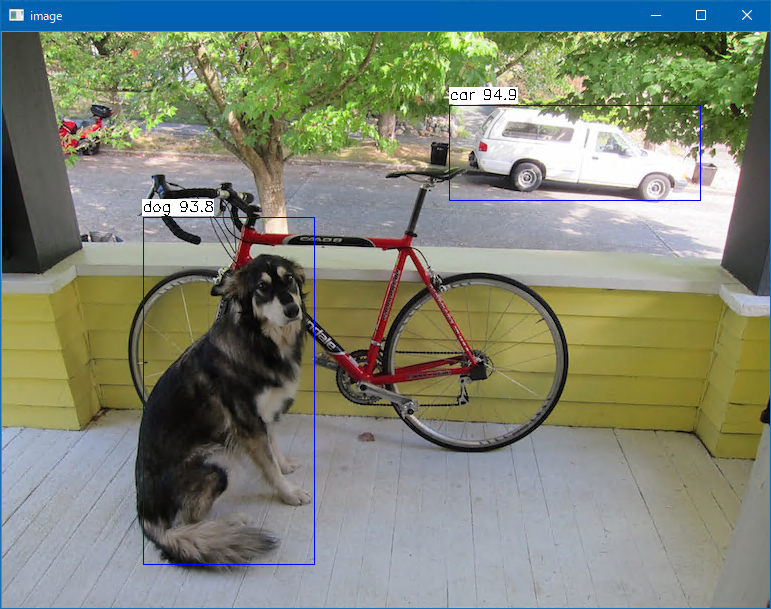

# Faster RCNN
  
This program is ported by C# from examples/fasterrcnn.cpp. 
 
## How to use? 
 
## 1. Build 
 
1. Open command prompt and change to &lt;FasterRCNN_dir&gt; 
1. Type the following command 
```` 
dotnet build -c Release 
```` 
2. Copy ***NcnnDotNetNative.dll*** to output directory; &lt;FasterRCNN_dir&gt;\bin\Release\netcoreapp3.1. 
 
And extract them and copy to extracted files to &lt;FasterRCNN_dir&gt;. 

## 2. Download demo data

Download test data from the following urls.

- https://github.com/nihui/ncnn-assets/tree/master/models
  - ZF_faster_rcnn_final.bin.z01
  - ZF_faster_rcnn_final.bin.z02
  - ZF_faster_rcnn_final.bin.zip
  - ZF_faster_rcnn_final.param

And extract them and copy to extracted files to &lt;FasterRCNN_dir&gt;.
 
## 3. Run 
 
The following result is example. 
 
```` 
cd <FasterRCNN_dir> 
dotnet run --configuration Release -- dog.jpg

[0 GeForce GTX 1080]  queueC=2[8]  queueG=0[16]  queueT=1[1]  buglssc=0
[0 GeForce GTX 1080]  fp16p=1  fp16s=1  fp16a=0  int8s=1  int8a=1
[1 Intel(R) UHD Graphics 630]  queueC=0[1]  queueG=0[1]  queueT=0[1]  buglssc=0
[1 Intel(R) UHD Graphics 630]  fp16p=1  fp16s=1  fp16a=1  int8s=1  int8a=1
7 = 0.94920 at 447.28 72.53 251.93 96.47
7 = 0.94920 at 447.28 72.53 251.93 96.47
7 = 0.94920 at 447.28 72.53 251.93 96.47
7 = 0.94920 at 447.28 72.53 251.93 96.47
7 = 0.94920 at 447.28 72.53 251.93 96.47
7 = 0.94920 at 447.28 72.53 251.93 96.47
7 = 0.94920 at 447.28 72.53 251.93 96.47
7 = 0.94920 at 447.28 72.53 251.93 96.47
7 = 0.94920 at 447.28 72.53 251.93 96.47
7 = 0.94920 at 447.28 72.53 251.93 96.47
7 = 0.94920 at 447.28 72.53 251.93 96.47
7 = 0.94920 at 447.28 72.53 251.93 96.47
7 = 0.94920 at 447.28 72.53 251.93 96.47
7 = 0.94920 at 447.28 72.53 251.93 96.47
7 = 0.94920 at 447.28 72.53 251.93 96.47
7 = 0.94920 at 447.28 72.53 251.93 96.47
7 = 0.94920 at 447.28 72.53 251.93 96.47
7 = 0.94920 at 447.28 72.53 251.93 96.47
7 = 0.94920 at 447.28 72.53 251.93 96.47
7 = 0.94920 at 447.28 72.53 251.93 96.47
7 = 0.94920 at 447.28 72.53 251.93 96.47
12 = 0.93823 at 140.84 184.89 172.13 347.51
````

