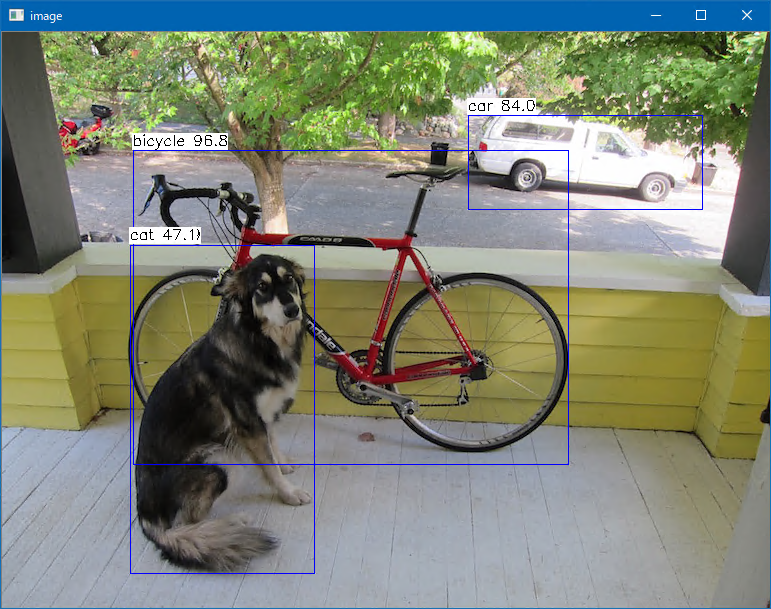

# MobileNet V2 SSD Lite
  
This program is ported by C# from examples/mobilenetssd.cpp. 
 
## How to use? 
 
## 1. Build 
 
1. Open command prompt and change to &lt;MobileNetV2SSDLite_dir&gt; 
1. Type the following command 
```` 
dotnet build -c Release 
```` 
2. Copy ***NcnnDotNetNative.dll*** to output directory; &lt;MobileNetV2SSDLite_dir&gt;\bin\Release\netcoreapp3.1. 
 
And extract them and copy to extracted files to &lt;MobileNetV2SSDLite_dir&gt;. 

## 2. Download demo data

Download test data from the following urls.

- https://github.com/nihui/ncnn-assets/tree/master/models
  - mobilenetv2_ssdlite_voc.bin
  - mobilenetv2_ssdlite_voc.param

And extract them and copy to extracted files to &lt;MobileNetV2SSDLite_dir&gt;.
 
## 3. Run 
 
The following result is example. 
 
```` 
cd <MobileNetV2SSDLite_dir> 
dotnet run --configuration Release -- dog.jpg

vkEnumerateInstanceExtensionProperties failed -6
2 = 0.96775 at 130.60 118.44 436.14 315.11
7 = 0.83982 at 465.92 83.44 235.06 94.72
12 = 0.83866 at 128.00 212.55 185.20 328.66
8 = 0.47114 at 128.00 212.55 185.20 328.66
````

