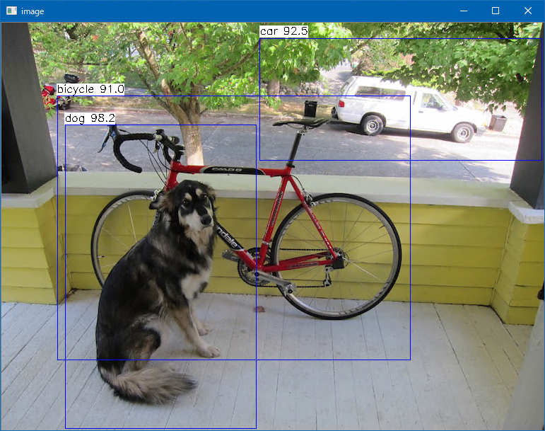

# MobileNet V3 SSD Lite
  
This program is ported by C# from examples/mobilenetv3ssdlite.cpp. 
 
## How to use? 
 
## 1. Build 
 
1. Open command prompt and change to &lt;MobileNetV3SSDLite_dir&gt; 
1. Type the following command 
```` 
dotnet build -c Release 
```` 
2. Copy ***NcnnDotNetNative.dll*** to output directory; &lt;MobileNetV3SSDLite_dir&gt;\bin\Release\netcoreapp3.1. 
 
And extract them and copy to extracted files to &lt;MobileNetV3SSDLite_dir&gt;. 

## 2. Download demo data

Download test data from the following urls.

- https://github.com/xingjinglu/models_collection/tree/master/ncnn
  - mobilenetv3_ssdlite_voc.bin
  - mobilenetv3_ssdlite_voc.param

And extract them and copy to extracted files to &lt;MobileNetV3SSDLite_dir&gt;.
 
## 3. Run 
 
The following result is example. 
 
```` 
cd <MobileNetV3SSDLite_dir> 
dotnet run --configuration Release -- dog.jpg

[0 GeForce GTX 1080]  queueC=2[8]  queueG=0[16]  queueT=1[1]  buglssc=0
[0 GeForce GTX 1080]  fp16p=1  fp16s=1  fp16a=0  int8s=1  int8a=1
[1 Intel(R) UHD Graphics 630]  queueC=0[1]  queueG=0[1]  queueT=0[1]  buglssc=0
[1 Intel(R) UHD Graphics 630]  fp16p=1  fp16s=1  fp16a=1  int8s=1  int8a=1
12 = 0.98165 at 89.52 144.42 271.03 429.66
7 = 0.92518 at 365.21 21.90 400.23 172.82
2 = 0.91001 at 78.81 103.12 500.17 373.81
````

