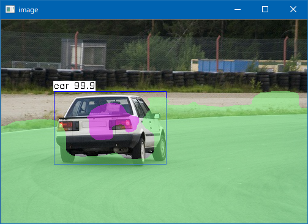

# PeleeNet SSD Seg
  
This program is ported by C# from examples/peleenetssd_seg.cpp.

## How to use? 
 
## 1. Build 
 
1. Open command prompt and change to &lt;PeleeNetSSDSeg_dir&gt; 
1. Type the following command 
```` 
dotnet build -c Release 
```` 
2. Copy ***NcnnDotNetNative.dll*** to output directory; &lt;PeleeNetSSDSeg_dir&gt;\bin\Release\netcoreapp3.1. 
 
And extract them and copy to extracted files to &lt;PeleeNetSSDSeg_dir&gt;. 

## 2. Download demo data

Download test data from the following urls.

- https://github.com/nihui/ncnn-assets/tree/master/models
  - pelee.bin
  - pelee.param

And extract them and copy to extracted files to &lt;PeleeNetSSDSeg_dir&gt;.
 
## 3. Run 
 
The following result is example. 
 
```` 
cd <PeleeNetSSDSeg_dir> 
dotnet run --configuration Release -- dog.jpg

vkEnumerateInstanceExtensionProperties failed -6
12 = 0.99775 at 137.99 209.13 186.70 332.18
7 = 0.99636 at 465.98 72.85 222.67 98.30
2 = 0.99473 at 106.52 141.06 467.29 273.91
````

