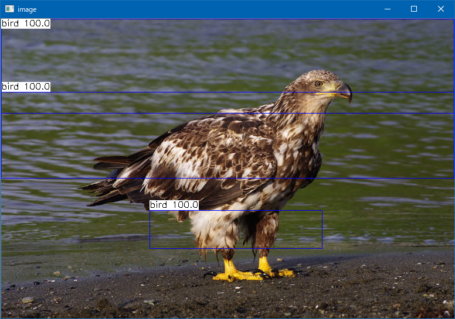

# R-FCN (Region-based Fully Convolutional Networks)
  
This program is ported by C# from examples/rfcn.cpp. 
 
## How to use? 
 
## 1. Build 
 
1. Open command prompt and change to &lt;RFCN_dir&gt; 
1. Type the following command 
```` 
dotnet build -c Release 
```` 
2. Copy ***NcnnDotNetNative.dll*** to output directory; &lt;RFCN_dir&gt;\bin\Release\netcoreapp3.1. 
 
And extract them and copy to extracted files to &lt;RFCN_dir&gt;. 

## 2. Download demo data

Download test data from the following urls.

- https://github.com/nihui/ncnn-assets/tree/master/models
  - rfcn_end2end.bin.z01
  - rfcn_end2end.bin.zip
  - rfcn_end2end.param

And extract them and copy to extracted files to &lt;RFCN_dir&gt;.
 
## 3. Run 
 
The following result is example. 
 
```` 
cd <RFCN_dir> 
dotnet run --configuration Release -- eagle.jpg

vkEnumerateInstanceExtensionProperties failed -6
3 = 1.00000 at 253.45 327.21 294.89 65.97
3 = 1.00000 at 0.00 0.00 773.00 273.40
3 = 1.00000 at 0.00 0.00 773.00 273.40
3 = 1.00000 at 0.00 0.00 773.00 273.40
3 = 1.00000 at 253.45 327.21 294.89 65.97
3 = 1.00000 at 253.45 327.21 294.89 65.97
3 = 1.00000 at 253.45 327.21 294.89 65.97
3 = 1.00000 at 0.00 0.00 773.00 273.40
3 = 1.00000 at 0.00 0.00 773.00 273.40
3 = 1.00000 at 0.00 0.00 773.00 273.40
3 = 1.00000 at 253.45 327.21 294.89 65.97
3 = 1.00000 at 0.00 0.00 773.00 273.40
3 = 1.00000 at 253.45 327.21 294.89 65.97
3 = 1.00000 at 253.45 327.21 294.89 65.97
3 = 1.00000 at 0.00 0.00 773.00 273.40
3 = 1.00000 at 0.00 125.35 773.00 36.96
3 = 1.00000 at 0.00 0.00 773.00 273.40
3 = 1.00000 at 0.00 0.00 773.00 273.40
3 = 1.00000 at 253.45 327.21 294.89 65.97
3 = 1.00000 at 253.45 327.21 294.89 65.97
3 = 1.00000 at 253.45 327.21 294.89 65.97
3 = 1.00000 at 0.00 0.00 773.00 273.40
````

