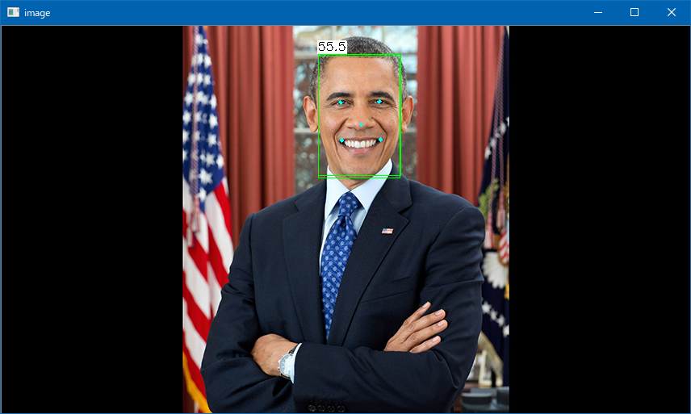

# SCRFD
  
This program is ported by C# from https://github.com/nihui/ncnn-android-scrfd/tree/master/app/src/main/jni. 
 
## How to use? 
 
## 1. Build 
 
1. Open command prompt and change to &lt;SCRFD_dir&gt; 
1. Type the following command 
```` 
dotnet build -c Release 
```` 
2. Copy ***NcnnDotNetNative.dll*** to output directory; &lt;SCRFD_dir&gt;\bin\Release\netcoreapp3.1. 
 
And extract them and copy to extracted files to &lt;SCRFD_dir&gt;. 

## 2. Download demo data

Download model and param files from the following urls.

- https://github.com/nihui/ncnn-android-scrfd/tree/master/app/src/main/assets

And extract them and copy to extracted files to &lt;SCRFD_dir&gt;.
 
## 3. Run 
 
The following result is example. 
 
```` 
cd <SCRFD_dir> 
dotnet run -c Release obama-480p.jpg 500m_kps 0.5 0.5

[0 NVIDIA GeForce GTX 1080]  queueC=2[8]  queueG=0[16]  queueT=1[2]
[0 NVIDIA GeForce GTX 1080]  bugsbn1=0  bugbilz=0  bugcopc=0  bugihfa=0
[0 NVIDIA GeForce GTX 1080]  fp16-p/s/a=1/1/0  int8-p/s/a=1/1/1
[0 NVIDIA GeForce GTX 1080]  subgroup=32  basic=1  vote=1  ballot=1  shuffle=1
[1 Intel(R) UHD Graphics 630]  queueC=0[1]  queueG=0[1]  queueT=0[1]
[1 Intel(R) UHD Graphics 630]  bugsbn1=0  bugbilz=65  bugcopc=0  bugihfa=0
[1 Intel(R) UHD Graphics 630]  fp16-p/s/a=1/1/1  int8-p/s/a=1/1/1
[1 Intel(R) UHD Graphics 630]  subgroup=32  basic=1  vote=1  ballot=1  shuffle=1
scrfd_500m_kps-opt2.param
scrfd_500m_kps-opt2.bin
````

