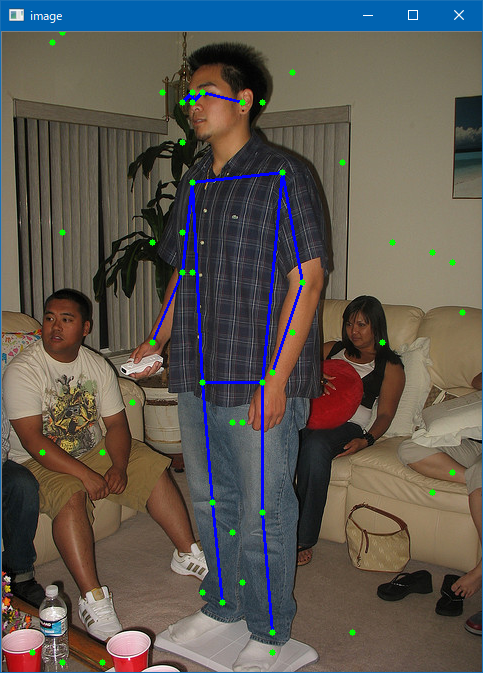

# Simple Pose
  
This program is ported by C# from examples/simplepose.cpp.

## How to use? 
 
## 1. Build 
 
1. Open command prompt and change to &lt;SimplePose_dir&gt; 
1. Type the following command 
```` 
dotnet build -c Release 
```` 
2. Copy ***NcnnDotNetNative.dll*** to output directory; &lt;SimplePose_dir&gt;\bin\Release\netcoreapp3.1. 
 
And extract them and copy to extracted files to &lt;SimplePose_dir&gt;. 

## 2. Download demo data

Download test data from the following urls.

- https://github.com/nihui/ncnn-assets/tree/master/models
  - pose.bin
  - pose.param

And extract them and copy to extracted files to &lt;SimplePose_dir&gt;.
 
## 3. Run 
 
The following result is example. 
 
```` 
cd <SimplePose_dir> 
dotnet run --configuration Release -- person.jpg

[0 GeForce GTX 1080]  queueC=2[8]  queueG=0[16]  queueT=1[1]  buglssc=0
[0 GeForce GTX 1080]  fp16p=1  fp16s=1  fp16a=0  int8s=1  int8a=1
[1 Intel(R) UHD Graphics 630]  queueC=0[1]  queueG=0[1]  queueT=0[1]  buglssc=0
[1 Intel(R) UHD Graphics 630]  fp16p=1  fp16s=1  fp16a=1  int8s=1  int8a=1
190.00 70.00 = 0.97070
200.00 60.00 = 0.92676
190.00 60.00 = 0.95703
240.00 70.00 = 0.94434
180.00 70.00 = 0.71387
280.00 140.00 = 0.87305
190.00 150.00 = 0.91992
300.00 250.00 = 0.87891
180.00 240.00 = 0.87744
270.00 340.00 = 0.91699
150.00 310.00 = 0.84082
260.00 350.00 = 0.73389
200.00 350.00 = 0.74268
260.00 480.00 = 0.79883
210.00 470.00 = 0.82422
270.00 600.00 = 0.87012
220.00 570.00 = 0.80762
60.00 0.00 = 11.85496
240.00 450.00 = 0.00000
320.00 470.00 = 0.00000
440.00 530.00 = 0.00001
200.00 80.00 = 0.00000
40.00 450.00 = 0.00000
290.00 70.00 = 0.00000
340.00 580.00 = 0.00000
40.00 210.00 = 0.00000
90.00 0.00 = 0.00000
260.00 70.00 = 16291541277989149492979270386723061760.00000
460.00 280.00 = 35283279746512445869498638337153433600.00000
160.00 60.00 = 91.96724
40.00 420.00 = 0.24683
230.00 500.00 = 0.30078
290.00 300.00 = 3426893824.00000
130.00 370.00 = 271663562455163699736396989202432.00000
380.00 310.00 = 0.39282
150.00 500.00 = 0.19531
390.00 210.00 = 0.23096
430.00 220.00 = 0.21021
180.00 200.00 = 0.33887
150.00 210.00 = 0.23364
290.00 40.00 = 0.25244
350.00 600.00 = 0.24207
450.00 230.00 = 0.20874
230.00 90.00 = 0.18823
450.00 440.00 = 0.32715
340.00 130.00 = 0.28296
270.00 620.00 = 0.22437
10.00 90.00 = 0.18445
150.00 160.00 = 0.18750
180.00 620.00 = 0.15466
30.00 620.00 = 0.29614
190.00 240.00 = 0.24255
200.00 540.00 = 0.16187
180.00 110.00 = 0.20215
230.00 390.00 = 0.29565
430.00 460.00 = 0.29053
240.00 550.00 = 0.26904
60.00 630.00 = 0.24524
200.00 560.00 = 0.27490
50.00 10.00 = 0.27295
100.00 420.00 = 0.24292
100.00 630.00 = 0.39209
240.00 390.00 = 0.43652
60.00 200.00 = 0.55420
````

