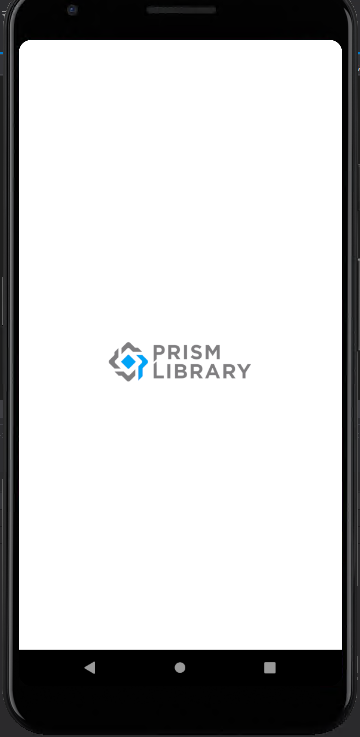
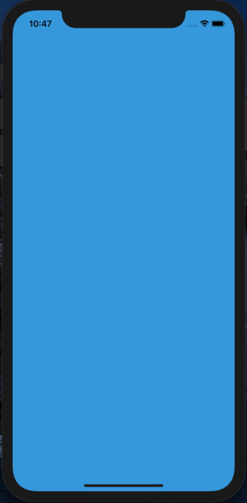

# Xamarin.YoloV3
  
This program is ported by C# from examples/yolov3.cpp and works on Xamarin. 
 
## How to use? 
 
## 1. Build 
 
1. Open solution file by Visual Studio with Xamarin.
1. Restore nuget package
1. Buuild 

## 2. Download demo data

Download test data from the following urls.

- https://drive.google.com/open?id=1V9oKHP6G6XvXZqhZbzNKL6FI_clRWdC-
  - mobilenetv2_yolov3.bin
- https://drive.google.com/open?id=1DBcuFCr-856z3FRQznWL_S5h-Aj3RawA
  - mobilenetv2_yolov3.param

And extract them and copy to examples/Xamarin/YoloV3/YoloV3/data.
 
## 3. Run 

You can build and run from `Visual Studio for Mac`
You can choose a image file to detect objects.

 
