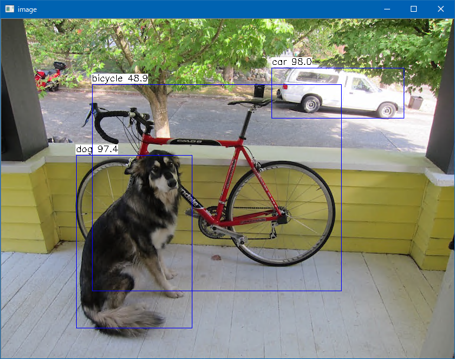

# YOLO V3
  
This program is ported by C# from examples/yolov3.cpp. 
 
## How to use? 
 
## 1. Build 
 
1. Open command prompt and change to &lt;YoloV3_dir&gt; 
1. Type the following command 
```` 
dotnet build -c Release 
```` 
2. Copy ***NcnnDotNetNative.dll*** to output directory; &lt;YoloV3_dir&gt;\bin\Release\netcoreapp3.1. 
 
And extract them and copy to extracted files to &lt;YoloV3_dir&gt;. 

## 2. Download demo data

Download test data from the following urls.

- https://drive.google.com/open?id=1V9oKHP6G6XvXZqhZbzNKL6FI_clRWdC-
  - mobilenetv2_yolov3.bin
- https://drive.google.com/open?id=1DBcuFCr-856z3FRQznWL_S5h-Aj3RawA
  - mobilenetv2_yolov3.param

And extract them and copy to extracted files to &lt;YoloV3_dir&gt;.
 
## 3. Run 
 
The following result is example. 
 
```` 
cd <YoloV3_dir> 
dotnet run --configuration Release -- dog.jpg

vkEnumerateInstanceExtensionProperties failed -6
7 = 0.98014 at 458.34 82.56 224.54 86.26
12 = 0.97378 at 127.00 230.88 196.63 294.23
2 = 0.48931 at 153.65 110.83 423.08 351.21
````

